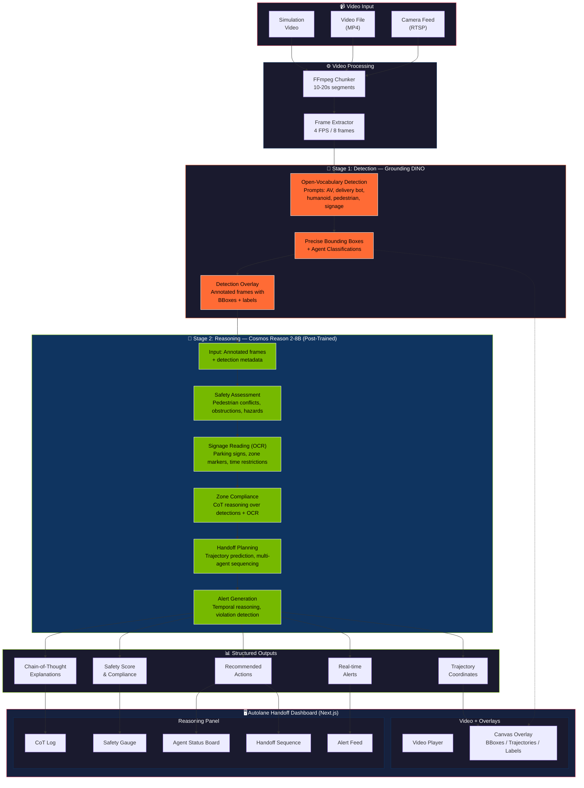

# Project Plan

## Cosmos Cookoff: Autolane Handoff — Autonomous Multi-Agent Delivery Coordination

## Project Name: **Autolane Handoff**
*A two-stage AI system that detects and reasons about multi-agent autonomous delivery handoffs at curbside zones using Grounding DINO + NVIDIA Cosmos Reason 2*

---

## Executive Summary

Autolane Handoff is a two-stage video analytics and embodied reasoning system that watches curbside/loading zone video feeds and performs real-time multi-agent coordination reasoning for autonomous last-mile delivery. It combines **Grounding DINO** for pixel-accurate object detection with **Cosmos Reason 2** (post-trained on curbside logistics scenarios) for physical reasoning:

**Stage 1 — Detection (Grounding DINO):** Precise bounding boxes for all agents in the scene — AVs, delivery bots, humanoid robots, pedestrians, signage. Open-vocabulary, so no custom detection training needed.

**Stage 2 — Reasoning (Cosmos Reason 2, post-trained):** Takes the video frames with detection overlays and performs chain-of-thought reasoning about:

1. **Safety & compliance** — is this zone safe for a handoff? Is signage (OCR) restricting operations? Are there pedestrian conflicts?
2. **Multi-agent handoff sequences** — when should the delivery bot approach the AV? What trajectory should it take? What's the optimal staging position?
3. **Explainable decisions** — every coordination decision comes with a full chain-of-thought audit trail

This two-stage approach plays to each model's strengths: Grounding DINO for spatial precision, Cosmos Reason 2 for physical common sense and planning. It's the same pattern NVIDIA uses in their own VSS (Video Search and Summarization) blueprint — validating their ecosystem while solving a real problem Autolane faces: orchestrating heterogeneous autonomous systems (Tesla vehicles, Unitree G1 humanoids, delivery bots) at retail curbside locations.

---

## Why This Wins

| Judging Criteria | How Autolane Handoff Scores |
|---|---|
| **Quality of Ideas** | Multi-agent handoff reasoning is novel — nobody else is doing heterogeneous robot fleet coordination with a VLM. Most entries will be single-robot or single-AV. |
| **Technical Implementation** | Two-stage pipeline (Grounding DINO + Cosmos Reason 2) mirrors NVIDIA's own VSS blueprint pattern. Post-training on domain-specific data. Hits multiple cookbook recipes. Shows model-awareness by using each tool for its strengths. |
| **Design** | Web UI showing live video with precise detection overlays, trajectory predictions, and chain-of-thought reasoning explanations. Clean, professional. |
| **Impact** | Solves a real commercial problem. Autolane is an NVIDIA Inception company deploying at Simon Property Group malls. This is production-bound, not a toy. |

**Key differentiators from other entries:**
- Real company, real problem, real deployment context
- Multi-agent (not single robot) — exploits Cosmos Reason 2's reasoning across multiple entities simultaneously
- Two-stage architecture shows model maturity (judges love seeing you understand what VLMs are good at vs not)
- Post-training on domain-specific data (most entries will use off-the-shelf)
- Combines 3+ ecosystem tools (Grounding DINO + Cosmos Reason 2 + VSS pattern + post-training recipe)
- OCR on signage + spatial reasoning + temporal tracking + trajectory prediction in one system

---

## Architecture



> [🎨 Edit this diagram on Mermaid.ai](https://mermaid.ai/live/edit?utm_source=mermaid_mcp_server&utm_medium=remote_server&utm_campaign=claude#pako:eNqdVk-P2kYU_yojVoo2WkjAwCbhUMmwsCFlsQVe1LRU1WCPwVl7hnrGmyVVpZ57aA-tKrWX9lL12Gv7dfIF2o_QNzP-g4Hd7JaL8fP7vb-_92a-qrjMI5VOxQ_ZW3eFY4Gc7pwi-PFksYzxeoWGdJ2Iz-aVf3_94W80CzzCtGhe-Vxryl_PvACVHo5IjNGAEG8-p8cTZ2o_LqnNhmegpo0MgpBIrQu7VVaaDqWtaRAlIRYBo6CkELkSod6c7kRpx8wlnAd0Cdj3v_z8z1_fp8EWX8oRv7wcfwy6g0G0JkvUWyX0isTgq1GvGXWOOFlGhApeAg0m5kVfgmLIFPVvRIxdwSSqhQb2FD1Fz5Evv_E7g50KvCQNVdPv_tRvqNFBZ0QQV2aM3n_zIzqPWUI9CBudDcdWKYxzKQG4tSa0NmMuXkCp4k1hAAKCtKO14B1kzqrII2FwTUBjwUQVPq6SCFMWeFW0Jh7hIg4wrSIeLCmEUnLV7VqffGFdOuDNjokbcIK6WVxddgOJzukJMpdQKtQLMdTZD1zVtnLlrFl_MjJfg5kiSwtCCvEGLJiUMoEF8dLqobeBWIG8q1ygExTiBQn5fhFQrfZRHqN6SR19oPiGKv4fv6XFNzpoQjBnVKYli99jPGI8FSKj9ryLjm3GRc2JcUCJV2asF8RpStn0KB4bwzG4UcMCbdhJUdXNy2sREYE9LHDJri05MsU-ERtkcg4slpSUzc27hlxG_TBwBa8itgBZouzB2wq_w7FXrpltqMlSbZbJqTYeW73JY2kUx1fyXdIA8O8YJSgCGYnhTQRA-Fg5dfe7azfB7qcS0APWhRCXK2e7xxzAZHVl0O4iY9lVcFw20wIzLzH1mO8jO8RU4sAOFP0NkYO2QeuYeDqCKoIFIYIaVtzj5MuEUHd3yu02WDRDAovtnFBYTul0OCRasxiHRXhVdB0wvXCKIMt7CfqpKGY39MPQj6Z-tPSjfTvzrEQAFbjepd8C9WSzEkgo-1JeUJYcut4K-FZjfs1ZsWS5ks3v36yhNAdmzJmYrwBSVEu1gMXQZSBeWXdqDvrO64JeU5fFsmWPtju4DTB7ztAaTwExIS6LgIie2vLmATqYoz7sfqWKw5qkjlSUXbh7L55hvlowYK0q0U-_yyVuJgLaAszKeJEroeMxuRFP3vDbhnE0KaS5D3Uo2GAwzE-ik2wTlbNQB5adawEfN3BA7GpYM3Xw0WvMtxZaurieorwZgXod7e8xVYi9MPXmyeIslpOS7AUBXLkcyjhg4EZsufdddrvo9TlOdra8atp5fywZp3c57EWRcFjxUOg9VWd40R8Nx_2taZ3q-TtgVnJBBafHUF0ODua_xQi4TqhpUoe0FsHVYVcEF4VdkfqrhOqo1kL1VwnVmaGF6TmhxHKyM9d2W9u0nNK7nK2SQA9QSZSOSFmmRiEzXpxUT9RRlQZtOZnPy6EWSXfpcZbmqtzlnrUwdagdyfbti7NWpV9UNEVg0l06g2ITEn2xQ34Qhp2jBm5gg1Rh47Mr0jkiL1rt03rVZSGLO0e-72_jijvWYXDdb7ZuBevb0GGg758umu27gEYKTF1kwGenixf12zym6_awyzuRxfJJsadGo3nPIhWb538UaWsf3Bu9jde3JY1Mi1rU2M9g9Xp9G5TT9YG4bLbuBSt1VB6xGpW24cPO7MaDEcaDEc0HI1oPRrTvh6h8_R8zq0Ui)

### Component Breakdown

**1. Video Ingestion Layer**
- Accepts video files (MP4) or RTSP camera streams
- Chunks video into 10-20 second segments (following VSS pattern)
- Samples frames at configurable FPS (default: 4 FPS per Cosmos Reason 2 training setup)
- Passes chunks to Stage 1 detection

**2. Stage 1: Detection — Grounding DINO**
- Open-vocabulary object detection — no custom training needed
- Text prompts: `"Tesla Model Y . Tesla Model 3 . Waymo Jaguar I-PACE . delivery robot . humanoid robot . pedestrian . parking sign . loading zone sign . obstruction"`
- Outputs pixel-accurate bounding boxes + confidence scores + classifications
- Renders detection overlay: annotated frames with BBoxes and labels burned in
- Also passes raw detection metadata (coordinates, classes, confidence) as structured data

**3. Stage 2: Reasoning — Cosmos Reason 2-8B (Post-Trained)**
- Base: `nvidia/Cosmos-Reason2-8B` from Hugging Face
- Post-trained via SFT on curbside logistics dataset (see Data Strategy below)
- Receives annotated frames (with Grounding DINO overlays) + detection metadata as context
- This is the key insight: Cosmos Reason 2 doesn't need to detect — it reasons over precise detections
- Deployed via vLLM or NIM container on GCP Vertex AI GPU instance

**4. Reasoning Pipeline**
Each video chunk goes through the following reasoning passes on the annotated frames:

| Pass | Purpose | Cosmos Reason 2 Capability |
|---|---|---|
| **Safety Assessment** | Detect pedestrian conflicts, obstructions, hazards given detected agents | Spatial + temporal reasoning over BBox positions |
| **Signage Reading** | Read parking signs, loading zone markers, time restrictions | OCR (native capability) |
| **Zone Compliance** | Determine if zone permits autonomous operations | CoT reasoning over detections + OCR |
| **Handoff Planning** | Generate optimal handoff sequence and trajectories | Trajectory prediction + embodied reasoning |
| **Alert Generation** | Flag safety violations or coordination failures | Temporal reasoning across chunks |

**5. Web Dashboard (Next.js)**
- Real-time video player with canvas overlay for Grounding DINO BBox annotations
- Side panel showing chain-of-thought reasoning from Cosmos Reason 2
- Agent status board (which agents are present, their states)
- Safety score gauge
- Handoff sequence timeline
- Alert feed

---

## Data Strategy: Synthetic Generation with Cosmos Predict 2.5

### The Cosmos Flywheel

This is the killer differentiator: we use **Cosmos Predict 2.5** to generate synthetic curbside delivery videos, then post-train **Cosmos Reason 2** on them. This demonstrates NVIDIA's full Cosmos ecosystem working as a closed loop:

```
Real photos (Stanford Shopping Center) 
  → Cosmos Predict 2.5 (Image2World) 
    → Synthetic curbside delivery videos 
      → Grounding DINO annotations 
        → Cosmos Reason 2 post-training 
          → Production handoff reasoning
```

Most entries will use one Cosmos model. We use **three** (Predict + Reason + Grounding DINO from NVIDIA's VSS blueprint). This is exactly the story NVIDIA is selling to the Physical AI market.

### Source Imagery

**Primary: Stanford Shopping Center site photos (Image2World)**
- Chad captures real photos of curbside zones, loading areas, parking signage at Stanford Shopping Center — an actual Autolane pilot site
- These become conditioning frames for Cosmos Predict 2.5 Image2World mode
- Result: synthetic videos grounded in a real deployment location
- This is irreproducible by other contestants — nobody else has pilot site imagery

**Secondary: Text2World generation**
- Pure text prompts for scenario diversity (different times of day, weather, agent configurations)
- Covers edge cases that may not exist at Stanford (e.g., multiple humanoid robots, heavy pedestrian traffic, nighttime operations)

### Cosmos Predict 2.5 Configuration

**Model:** `nvidia/Cosmos-Predict2.5-14B` (we have A100 instances on GCP Vertex AI — plenty of VRAM)
**Output:** 5-second clips at 720p, 16 FPS (81 frames per clip)
**Modes used:**
- `Image2World` — Real Stanford photos → animated curbside scenarios
- `Text2World` — Text prompts → diverse scenario generation

### Prompt Strategy

**Image2World prompts** (paired with Stanford Shopping Center photos):
```
"A white Tesla Model Y Juniper pulls into the curbside loading zone 
in front of a shopping mall. A small wheeled delivery robot exits 
from the rear. Pedestrians walk along the sidewalk nearby. Parking 
signs visible on the curb. Daytime, clear weather, retail shopping 
center."

"A humanoid robot walks from the sidewalk toward a stopped silver 
Tesla Model 3 in the loading zone. The vehicle's rear trunk is open. 
A second delivery bot waits on the curb. Shopping center entrance 
visible in background."

"A white Waymo Jaguar I-PACE robotaxi with visible roof-mounted 
lidar sensor array is parked in a loading zone. A delivery robot 
approaches from the sidewalk to collect a package. A Tesla Model Y 
Juniper waits in the adjacent spot. Pedestrians nearby."

"Two vehicles are parked in adjacent loading zone spots — a black 
Tesla Model 3 and a white Waymo Jaguar I-PACE. A delivery robot 
navigates between them while a pedestrian crosses the loading zone. 
Security bollards mark the zone boundaries. Loading zone time 
restriction sign visible."
```

**Text2World prompts** (no conditioning image — pure generation):
```
"Nighttime curbside loading zone at a retail shopping center. 
Overhead lights illuminate the area. A white Tesla Model Y Juniper 
is parked with hazard lights on. A delivery robot approaches from 
the sidewalk. Wet pavement from recent rain reflects the lights."

"Busy curbside pickup area. Three pedestrians with shopping bags 
cross the loading zone. A Waymo Jaguar I-PACE robotaxi with 
roof-mounted lidar waits at the curb. A small delivery robot is 
staged on the sidewalk, waiting for the pedestrians to clear. 
Time-restricted parking sign shows 15-minute limit."

"Early morning, mostly empty parking lot. A Unitree-style humanoid 
robot walks along the curb toward a silver Tesla Model 3 with its 
trunk open. No pedestrians. Clear path. Loading zone markings 
painted on the asphalt."

"A white Tesla Model Y Juniper and a Waymo Jaguar I-PACE are both 
stopped in a curbside loading zone. Two wheeled delivery robots 
coordinate between the vehicles, one at each car's rear. A 
pedestrian with a stroller passes on the sidewalk. Shopping center 
storefronts visible in background. Midday sun, light shadows."
```

**Prompt augmentation:** Use an LLM to multiply 20 base prompts into 150+ variations with randomized:
- Time of day (dawn, morning, afternoon, dusk, night)
- Weather (clear, overcast, rain, wet pavement)
- Agent count (1-4 autonomous agents, 0-5 pedestrians)
- Vehicle types (Tesla Model Y Juniper, Tesla Model 3, Waymo Jaguar I-PACE)
- Agent types (delivery bots, humanoid robots, pedestrians, conventional vehicles)
- Signage variations (loading zone, no parking, time restricted, disabled)
- Risk levels (clear path, pedestrian conflict, double-parked, obstructed)

### Known Limitations (be transparent with judges)

From Cosmos Predict 2.5 model card: the model can produce temporal inconsistencies, object morphing, and imprecise physical interactions. For our use case this is actually a feature:
- Slight imperfections in training data improve model robustness (domain randomization effect)
- We're training *reasoning* not *perception* — Grounding DINO handles precise detection
- We explicitly state this tradeoff in our submission as a sign of model-awareness

### Annotation Pipeline

After generating synthetic videos, we annotate in Llava format for SFT:

**Step 1:** Generate synthetic clips with Cosmos Predict 2.5
**Step 2:** Run Grounding DINO on generated clips to detect agents/signage (gives us ground-truth BBoxes)
**Step 3:** Use Cosmos Reason 2 zero-shot to bootstrap draft QA pairs from annotated clips
**Step 4:** Human review + refinement of QA pairs (correct errors, add domain expertise)
**Step 5:** Export as Llava-format JSON for SFT

### Data Format (Llava Format — per ITS recipe)

```json
{
    "id": "curbside_handoff_001",
    "video": "path/to/curbside_scenario.mp4",
    "conversations": [
        {
            "from": "human",
            "value": "<video>\nAnalyze this curbside zone for autonomous delivery handoff readiness. Identify all agents, assess safety conditions, read any signage, and recommend the optimal handoff sequence."
        },
        {
            "from": "gpt",
            "value": "<think>\nI can see a curbside loading zone at a retail location. Let me analyze each element:\n\n1. **Agents detected:**\n   - One white sedan parked in the loading zone (appears to be an autonomous vehicle based on sensor array on roof)\n   - One small delivery bot (wheeled, approximately 2ft tall) staged on the sidewalk 15ft from the vehicle\n   - Two pedestrians walking on the sidewalk, moving away from the loading zone\n   - No humanoid robots visible\n\n2. **Safety assessment:**\n   - The pedestrians are moving away from the handoff zone — decreasing conflict risk\n   - The loading zone has clear ingress/egress paths\n   - No obstructions between the delivery bot staging area and the vehicle\n   - Weather appears clear, good visibility\n\n3. **Signage:**\n   - Sign reads \"LOADING ZONE - 15 MIN MAX - 6AM-8PM\"\n   - Current time appears to be daytime, within loading zone hours\n   - 15-minute limit means handoff must be efficient\n\n4. **Zone compliance:**\n   - Vehicle is properly positioned within loading zone markings\n   - No double-parking or blocking issues\n   - Zone permits commercial loading activities\n</think>\n\n<answer>\n**Handoff Readiness: READY (Score: 92/100)**\n\n**Agents:** AV (sedan, loading zone), delivery bot (sidewalk, staged), 2 pedestrians (departing)\n\n**Safety:** Clear path, no conflicts. Pedestrians moving away.\n\n**Signage:** Loading zone active, 15-min limit — prioritize fast handoff.\n\n**Recommended Sequence:**\n1. Delivery bot proceed from sidewalk staging to vehicle rear (trajectory: straight line, 15ft, estimated 30 seconds)\n2. AV opens rear cargo compartment\n3. Delivery bot loads/unloads package\n4. Delivery bot returns to sidewalk staging area\n5. AV departs loading zone\n\n**Time constraint:** Complete within 12 minutes to allow departure buffer.\n</answer>"
        }
    ]
}
```

### Dataset Size Target

Per the ITS recipe results: **SFT on just 341 videos / 5.6k QA pairs reached 93%+ accuracy in ~1 hour on 8xA100.** We don't need a massive dataset. Target:

| Component | Quantity | Source |
|---|---|---|
| Image2World clips | 80-100 clips | Stanford Shopping Center photos → Predict 2.5 |
| Text2World clips | 100-150 clips | LLM-augmented prompts → Predict 2.5 |
| Safety assessment QA | 150 clips × 2 questions | All clips, focus on conflict scenarios |
| Signage OCR QA | 60 clips × 2 questions | Clips with generated signage |
| Handoff planning QA | 100 clips × 2 questions | Multi-agent scenario clips |
| **Total** | **~200-250 clips, ~500-700 QA pairs** | Cosmos Predict 2.5 + manual refinement |

This is achievable in 3-4 days. Even 100 clips with 200 QA pairs would show meaningful post-training improvement over zero-shot.

---

## Technical Implementation Plan

### Infrastructure

| Component | Service | Notes |
|---|---|---|
| GPU Compute | GCP Vertex AI (project: `autolane-handoff-20260221`) | A100 GPU instances |
| Synthetic Data Gen | Cosmos Predict 2.5-14B | Image2World + Text2World for training data |
| Stage 1 Detection | Grounding DINO (open-vocabulary) | Run on same GPU instance, lightweight |
| Post-Training | Cosmos-RL SFT framework | Following ITS recipe exactly |
| Stage 2 Inference | vLLM on GCP | Cosmos Reason 2-8B (post-trained) |
| Web Dashboard | Next.js + React | Deployed on same instance or Vercel |
| Video Processing | FFmpeg + Python | Chunking, frame extraction, overlay rendering |
| Visualization | Canvas API overlay | BBoxes from GDINO, trajectories from Cosmos |

### Post-Training Config (adapted from ITS recipe)

```toml
[custom.dataset]
annotation_path = "/data/autolane-handoff/curbside_handoff_train.json"
media_path = "/data/autolane-handoff/videos/train"
system_prompt = "You are Autolane Handoff, an autonomous delivery coordination AI. You analyze curbside zones to reason about multi-agent handoff safety, compliance, and optimal sequencing for autonomous delivery operations."

[custom.vision]
nframes = 8  # 8 frames, higher resolution per frame (per ITS ablation: 3k tokens > 8k tokens)

[train]
optm_lr = 2e-5
output_dir = "outputs/autolane-handoff_handoff"
optm_warmup_steps = 0
optm_decay_type = "cosine"
optm_weight_decay = 0.01
train_batch_per_replica = 32
enable_validation = false
compile = false

[policy]
model_name_or_path = "nvidia/Cosmos-Reason2-8B"
model_max_length = 32768

[logging]
logger = ['console', 'wandb']
project_name = "autolane-handoff"
experiment_name = "curbside_handoff_sft"

[train.train_policy]
type = "sft"
mini_batch = 1
dataset.test_size = 0
dataloader_num_workers = 4
dataloader_prefetch_factor = 4

[train.ckpt]
enable_checkpoint = true
save_freq = 20

[policy.parallelism]
tp_size = 1
cp_size = 1
dp_shard_size = 8
pp_size = 1
```

### Inference Prompting Strategy

**System Prompt:**
```
You are Autolane Handoff, an AI system that reasons about autonomous 
delivery handoffs at curbside zones. You receive video frames that have 
been pre-processed with Grounding DINO object detection — bounding boxes 
and agent classifications are already overlaid on the frames. Your job 
is to REASON over these detections, not re-detect them. Specifically:

1. Assess safety conditions for autonomous operations given the 
   detected agents and their positions
2. Read and interpret any signage (parking signs, loading zone markers, 
   time restrictions) using OCR
3. Determine zone compliance for autonomous handoff operations
4. Plan optimal multi-agent handoff sequences with trajectories
5. Generate alerts for safety violations or coordination failures

Always reason step-by-step in <think> tags before providing your 
assessment in <answer> tags. Reference the detected agents by their 
bounding box labels when reasoning about spatial relationships.
```

**Per-Pass Prompts:**

Pass 1 — Safety + Compliance (with OCR):
```
<video>
You are viewing a curbside zone with Grounding DINO detection overlays.
Assess this zone for autonomous delivery handoff safety:
1. Analyze the spatial relationships between all detected agents
2. Read all visible signage and interpret restrictions
3. Identify any pedestrian conflict zones based on detected positions
4. Check for obstructions in the handoff path
5. Rate overall safety (0-100) with reasoning
```

Pass 2 — Handoff Planning:
```
<video>
Given the agents detected in this curbside zone (shown with bounding 
box overlays), plan the optimal handoff sequence:
1. Which agent should move first?
2. What trajectory should each agent follow? Provide coordinate paths.
3. What is the estimated time for the complete handoff?
4. What conditions would trigger an abort?
```

---

## Sprint Plan (Feb 19 → Mar 5)

### Phase 1: Foundation + Site Photos (Feb 19-21) — 3 days

- [ ] **Register** on Luma (deadline Feb 19!) and set up GCP project (`autolane-handoff-20260221`)
- [ ] **Enable** required GCP APIs and provision Vertex AI GPU instances
- [ ] **Deploy** Cosmos Reason 2-8B baseline on GCP Vertex AI
- [ ] **Deploy** Cosmos Predict 2.5-14B on same instance (Image2World + Text2World)
- [ ] **Deploy** Grounding DINO for detection stage
- [ ] **Test** zero-shot Reason 2 inference on any available parking lot videos
- [ ] **Capture** 30-50 photos at Stanford Shopping Center:
  - Curbside loading zones (multiple angles)
  - Parking signage (loading zone, time-restricted, no parking)
  - Delivery/pickup areas
  - Pedestrian crossing areas near curbs
  - Wide establishing shots of the curbside zone layout
- [ ] **Set up** the GitHub repo with README structure

### Phase 2: Synthetic Data Generation (Feb 21-24) — 3 days

- [ ] **Generate Image2World clips** from Stanford photos
  - Feed each photo + scenario prompt to Cosmos Predict 2.5
  - Target: 80-100 clips from real site imagery
  - Vary prompts: different agents, times of day, weather, risk levels
- [ ] **Generate Text2World clips** for diversity
  - LLM-augment 20 base prompts → 150+ variations
  - Target: 100-150 additional clips covering edge cases
  - Nighttime, rain, heavy pedestrian traffic, multiple robots, etc.
- [ ] **Run Grounding DINO** on all generated clips
  - Produces ground-truth BBox annotations for each clip
  - Quality check: discard clips where detection is poor (synthetic artifacts too severe)
- [ ] **Bootstrap QA annotations**
  - Run Cosmos Reason 2 zero-shot on annotated clips
  - Use outputs as draft QA pairs in Llava format
  - Human review: correct errors, add domain expertise, ensure CoT quality
  - Target: 500-700 QA pairs across safety, OCR, compliance, handoff planning

### Phase 3: Post-Training (Feb 24-26) — 2 days

- [ ] **Run SFT** following ITS recipe
  - Start with 2B model for fast iteration (~20 min per epoch)
  - Validate improvement over zero-shot on held-out clips
  - Train 8B model for final submission (~1-2 hours)
- [ ] **Evaluate** post-trained model vs zero-shot
  - Capture before/after comparison screenshots for demo video
  - Measure accuracy on safety assessment, signage OCR, handoff planning

### Phase 4: Pipeline + Dashboard (Feb 26-Mar 2) — 4 days

- [ ] **Build** two-stage inference pipeline
  - Grounding DINO detection → overlay rendering → Cosmos Reason 2 reasoning
  - FFmpeg chunking → frame extraction → GDINO → annotated frames → Reason 2 → structured output parsing
  - Python FastAPI backend
- [ ] **Build** web dashboard (Next.js)
  - Video player with canvas overlay for Grounding DINO BBoxes and Cosmos trajectory predictions
  - Side panel for chain-of-thought reasoning display
  - Agent status board
  - Safety score gauge
  - Handoff sequence timeline
  - Alert feed
- [ ] **Test** end-to-end on 3-5 diverse curbside scenarios (mix of Image2World and Text2World clips)

### Phase 5: Polish + Submit (Mar 2-5) — 3 days

- [ ] **Record** demo video (<3 minutes)
  - Structure: Problem (30s) → Cosmos Flywheel / Architecture (30s) → Live demo (90s) → Results/Impact (30s)
  - Show the full pipeline: real photos → Predict 2.5 → synthetic video → GDINO detection → Reason 2 reasoning
  - Show before/after post-training comparison
  - Show multi-agent reasoning with CoT
- [ ] **Write** project description for submission
- [ ] **Polish** README with deployment instructions
- [ ] **Clean** code, add comments, ensure reproducibility
- [ ] **Submit** via GitHub issue on nvidia-cosmos/cosmos-cookbook

---

## Demo Video Script (< 3 minutes)

### 0:00-0:30 — The Problem
"Autonomous delivery is here — but coordinating multiple autonomous agents at a curbside handoff point is an unsolved problem. When a Tesla arrives with a delivery, how does a Unitree G1 humanoid robot know when it's safe to approach? What if the loading zone is restricted? What if pedestrians are in the path? Today, this requires human operators monitoring cameras. Autolane Handoff automates this reasoning."

### 0:30-1:00 — The Cosmos Flywheel
"We use three NVIDIA Cosmos models in a closed loop. First, Cosmos Predict 2.5 generates synthetic curbside delivery videos from real photos of our pilot site at Stanford Shopping Center. Then we post-train Cosmos Reason 2 on this synthetic data. At inference time, Grounding DINO handles precise detection while Cosmos Reason 2 reasons about safety, compliance, and optimal handoff sequences — with full chain-of-thought explainability."

Quick architecture diagram flash showing: Real Photos → Predict 2.5 → Synthetic Data → Reason 2 Post-Training → Production Reasoning.

### 1:00-2:15 — Live Demo
Show the web dashboard with a curbside video playing:
- Point out BBox detections of vehicles, delivery bot, pedestrians
- Show OCR reading a loading zone sign
- Show the chain-of-thought reasoning panel explaining WHY it's safe/unsafe
- Show trajectory prediction for the delivery bot approach
- Show a safety alert triggering when a pedestrian enters the zone
- Show before/after: zero-shot vs post-trained model accuracy comparison

### 2:15-2:45 — Impact & Results
"Post-training Cosmos Reason 2 on synthetic data generated by Cosmos Predict 2.5 improved handoff reasoning accuracy from X% to Y%. The data generation pipeline — real photos in, synthetic training videos out — means we can scale to any new deployment site in hours, not weeks. Autolane Handoff is being developed by Autolane, an NVIDIA Inception company deploying autonomous delivery orchestration at Simon Property Group retail locations. This isn't a demo — it's the beginning of a production system."

### 2:45-3:00 — Close
"Autolane Handoff shows what's possible when the full Cosmos ecosystem works together: Predict generates worlds, Reason understands them, and real-world autonomous logistics gets safer. Built on NVIDIA Cosmos."

---

## Submission Checklist

Per competition requirements, the submission (GitHub issue on cosmos-cookbook) must include:

- [ ] **Text description** — features and functionality
- [ ] **Demo video** — under 3 minutes
- [ ] **Public GitHub repo URL** with:
  - [ ] Source code
  - [ ] README with deployment instructions
  - [ ] Post-training scripts and config
  - [ ] Inference pipeline code
  - [ ] Dashboard code
  - [ ] Sample videos for testing
  - [ ] Evaluation results (zero-shot vs post-trained)

---

## Repo Structure

```
autolane-handoff/
├── README.md                          # Project overview + deployment instructions
├── LICENSE
├── docs/
│   └── architecture.md                # Detailed architecture documentation
│
├── datagen/
│   ├── generate_image2world.py        # Cosmos Predict 2.5 Image2World pipeline
│   ├── generate_text2world.py         # Cosmos Predict 2.5 Text2World pipeline
│   ├── augment_prompts.py             # LLM-based prompt augmentation (20 → 150+)
│   ├── prompts/
│   │   ├── image2world_base.json      # Base prompts for Stanford photos
│   │   └── text2world_base.json       # Base text-only prompts
│   ├── site_photos/                   # Stanford Shopping Center reference photos
│   └── README.md                      # Data generation instructions
│
├── data/
│   ├── prepare_dataset.py             # Data preprocessing → Llava format
│   ├── bootstrap_annotations.py       # Use zero-shot Cosmos to bootstrap QA pairs
│   ├── sample_annotations.json        # Example annotations
│   └── README.md                      # Data annotation instructions
│
├── detection/
│   ├── grounding_dino.py              # Grounding DINO inference wrapper
│   ├── overlay.py                     # Render BBox overlays onto frames
│   ├── prompts.py                     # Open-vocabulary detection prompts
│   └── README.md                      # Detection stage setup
│
├── training/
│   ├── sft_config.toml                # SFT training config (adapted from ITS recipe)
│   ├── custom_sft.py                  # Custom SFT script
│   ├── evaluate.py                    # Evaluation script (zero-shot vs fine-tuned)
│   ├── eval_config.yaml               # Evaluation config
│   └── README.md                      # Training instructions
│
├── inference/
│   ├── pipeline.py                    # Two-stage pipeline: GDINO → Cosmos Reason 2
│   ├── prompts.py                     # System and per-pass prompts for Stage 2
│   ├── video_processor.py             # FFmpeg chunking + frame extraction
│   ├── output_parser.py               # Parse structured CoT outputs
│   ├── server.py                      # FastAPI inference server
│   └── README.md                      # Inference setup instructions
│
├── dashboard/
│   ├── package.json
│   ├── next.config.js
│   ├── src/
│   │   ├── app/
│   │   │   ├── page.tsx               # Main dashboard page
│   │   │   └── api/
│   │   │       ├── analyze/route.ts   # Video analysis endpoint
│   │   │       └── stream/route.ts    # SSE for real-time results
│   │   ├── components/
│   │   │   ├── VideoPlayer.tsx        # Video player + canvas overlay
│   │   │   ├── ReasoningPanel.tsx     # Chain-of-thought display
│   │   │   ├── AgentBoard.tsx         # Agent status board
│   │   │   ├── SafetyGauge.tsx        # Safety score visualization
│   │   │   ├── TrajectoryOverlay.tsx  # Trajectory visualization
│   │   │   └── AlertFeed.tsx          # Safety alert timeline
│   │   └── lib/
│   │       └── api-client.ts          # API client for inference server
│   └── README.md
│
├── scripts/
│   ├── setup_gcp.sh                   # GCP Vertex AI instance setup (all 3 models)
│   ├── deploy_models.sh               # Deploy Predict 2.5 + GDINO + Reason 2
│   └── run_demo.sh                    # End-to-end demo runner
│
└── evaluation/
    ├── results/
    │   ├── zero_shot_results.json
    │   └── post_trained_results.json
    ├── compare.py                     # Generate comparison visualizations
    └── README.md
```

---

## Risk Mitigation

| Risk | Likelihood | Impact | Mitigation |
|---|---|---|---|
| Cosmos Predict 2.5 generates low-quality curbside videos | Medium | High | Predict 2.5 is trained on 200M clips but may struggle with specific autonomous agent scenes. Mitigation: lean on Image2World with real Stanford photos as conditioning (more grounded than pure text). Accept some artifacts — we're training reasoning, not perception. |
| Not enough usable training clips after quality filtering | Medium | High | Generate 2-3x more clips than needed, aggressively filter. Even 100 good clips + 200 QAs will show improvement per ITS recipe findings. |
| Post-training doesn't improve meaningfully | Low | High | ITS recipe showed massive improvement even on small datasets. Worst case: use zero-shot with better prompts and focus on the pipeline/dashboard quality. |
| GCP GPU instance not enough for 3 models simultaneously | Medium | Medium | Run sequentially, not concurrently: Predict 2.5 for datagen (Phase 2) → free memory → GDINO + Reason 2 for training/inference (Phase 3+). Use 2B Predict model if 14B too heavy. |
| Dashboard too complex for timeline | Medium | Medium | Minimal viable dashboard — video player + text panel is sufficient. Fancy overlays are nice-to-have. |
| Demo video quality | Low | High | Record early, iterate. Use OBS. Script everything. |

---

## Strategic Notes

**For the judges (Nexar, Datature, HuggingFace, Nebius, NVIDIA):**
- **NVIDIA judges** will love the full Cosmos flywheel: Predict → Reason → production. This is exactly the ecosystem story they're selling. Plus an Inception company using Cosmos for production.
- **Nexar judges** will appreciate the AV fleet coordination angle — directly relevant to their dashcam/fleet intelligence business
- **HuggingFace judges** will appreciate the clean post-training methodology and multi-model pipeline
- **Datature judges** will like the synthetic data generation + annotation strategy — novel approach to training data scarcity
- **Nebius judges** will appreciate the compute-intensive approach to both data generation and training

**For the NVIDIA relationship:**
- This project directly supports the Autolane ↔ NVIDIA partnership narrative
- Demonstrates Cosmos ecosystem value beyond any single model
- DGX Spark tie-in: mention that production inference could run on DGX Spark at edge locations
- If we win the DGX Spark prize, it's directly useful for Autolane's edge deployment

**Double duty:**
- This demo can be repurposed for investor pitches (showing AI-powered orchestration)
- It can be shown to Simon Property Group as a capabilities preview
- It strengthens the case for deeper NVIDIA partnership / DRIVE Sim integration
- The synthetic data pipeline (real photos → Predict 2.5 → training data) is reusable for every new deployment site
